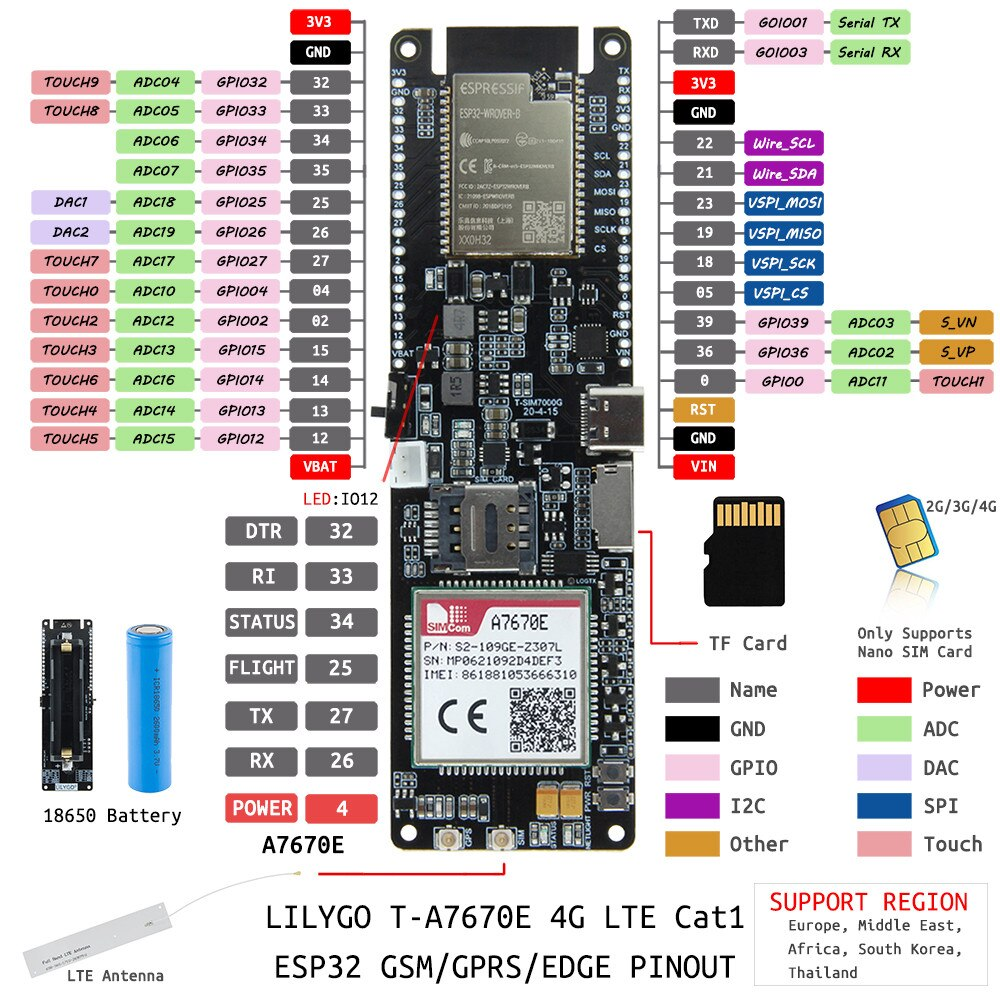

### Useful links

- Code examples from Xinyuan LilyGO on [GitHub](https://github.com/Xinyuan-LilyGO/LilyGO-T-A7670X/blob/main/examples).
- Board LILYGO® TTGO T-SIM-A7670E ESP32 4G LTE on [AliExpress](https://www.aliexpress.com/item/1005003036514769.html).
- Wireless Weather Station on [AliExpress](https://www.aliexpress.com/item/1005002879253918.html).
- Add ESP32 board to Arduino IDE [tutorial](https://randomnerdtutorials.com/installing-the-esp32-board-in-arduino-ide-windows-instructions/)

### Add board to Arduino IDE

1. Add `https://dl.espressif.com/dl/package_esp32_index.json` to Arduino IDE settings:

    

1. Search for `esp32`

    

### Pin schema for the LILYGO TTGO T-SIM-A7670E

